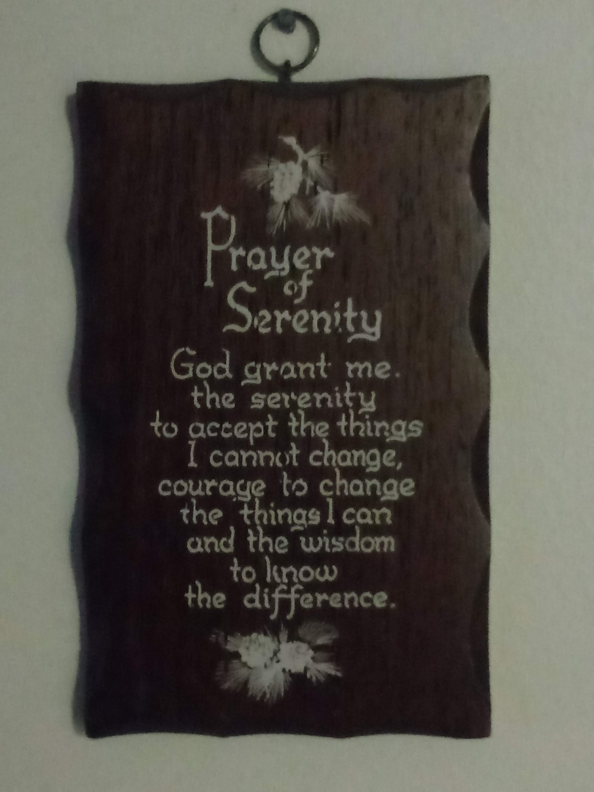

My name is Walter. I'm an American web developer from Nashua, New Hampshire. I enjoy lifting weights, shooting guns, and playing the piano. I'm also obsessed with self-improvement.

I decided to start a blog because I want to help young guys like myself help themselves and become winners.

This is a comprehensive self-improvement blog. Whether your goal is to lose fat, build muscle, eat healthier, look better, earn more money, gain confidence, earn respect, have a relationship with an amazing girl, quit smoking or drugs, or cultivate inner peace, you've come to the right place.

Self-improvement is a lifelong journey. Anyone at any age, in any country, with any amount of resources you have available can make meaningful, permanent, positive change. The only thing stopping you is yourself, and sometimes we're often our own worst enemy. Unless you're literally chained up in someone's basement, you have free will, and you have the power to change your life.

I keep this prayer nailed to the wall by my front door as a reminder. It's a reminder that keeps me grounded and focused. I recommend that the first step you take in your self-improvement journey be to put up the text in a visible place in your daily life, somewhere you'll see it every day so you can internalize it. You don't even have to be religious for this prayer to apply to your life, but if a higher power is a motivating force in your life, more power to you.

Thanks for reading.

Your boy,

Walter
